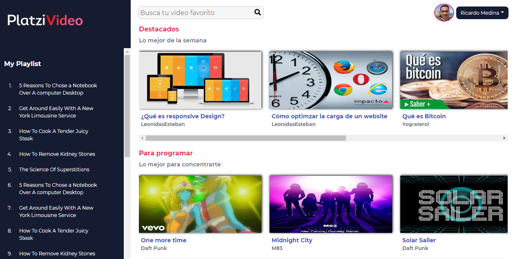

# Desarrollo con react js y redux en Platzi

Este repositorio contiene una página desarrollada con react js y redux.



[Ver la demo](https://ricrdomedina.github.io/platzi-video/)

## Cómo funciona?

``` bash
# Para instalar las dependencias
npm install

# Para el entorno de desarrollo
npm run build:dev

# Para el entorno de producción
npm run build:prod
```

## Licencia 

MIT
